# คู่มือผู้ดูแลระบบ
## ระบบจองพื้นที่บริการ Smart Creative Learning Space
### สำนักวิทยบริการ มหาวิทยาลัยนครพนม

**เวอร์ชัน:** 1.0
**วันที่:** เมษายน 2569
**ผู้จัดทำ:** สำนักวิทยบริการ มหาวิทยาลัยนครพนม

---

## สารบัญ

- [บทที่ 1 บทนำ](#บทที่-1-บทนำ)
- [บทที่ 2 การเข้าและออกจากระบบ](#บทที่-2-การเข้าและออกจากระบบ)
- [บทที่ 3 Dashboard](#บทที่-3-dashboard)
- [บทที่ 4 จัดการรายการจอง](#บทที่-4-จัดการรายการจอง)
- [บทที่ 5 จัดการวันหยุด](#บทที่-5-จัดการวันหยุด)
- [บทที่ 6 จัดการผู้ใช้ LINE](#บทที่-6-จัดการผู้ใช้-line)
- [บทที่ 7 จัดการห้อง (ผู้ดูแลระบบ)](#บทที่-7-จัดการห้อง-ผู้ดูแลระบบ)
- [บทที่ 8 จัดการเจ้าหน้าที่ (ผู้ดูแลระบบ)](#บทที่-8-จัดการเจ้าหน้าที่-ผู้ดูแลระบบ)
- [บทที่ 9 คำถามที่พบบ่อย](#บทที่-9-คำถามที่พบบ่อย)
- [ภาคผนวก](#ภาคผนวก)

---

## บทที่ 1 บทนำ

### 1.1 ภาพรวม Staff Portal

Staff Portal คือส่วนจัดการระบบจองพื้นที่บริการ Smart Creative Learning Space สำหรับเจ้าหน้าที่และผู้ดูแลระบบของสำนักวิทยบริการ ใช้สำหรับ:

- ติดตามรายการจองและยกเลิกการจอง
- กำหนดวันหยุดเพื่อปิดรับการจอง
- ตรวจสอบประวัติและจัดการสิทธิ์ผู้ใช้ LINE
- จัดการข้อมูลห้องและบัญชีเจ้าหน้าที่ (เฉพาะผู้ดูแลระบบ)

### 1.2 บทบาทและสิทธิ์ผู้ใช้

ระบบมี **2 บทบาท** ที่มีสิทธิ์การเข้าถึงต่างกัน:

| เมนู | เจ้าหน้าที่ | ผู้ดูแลระบบ |
|------|:-----------:|:-----------:|
| Dashboard | ✅ | ✅ |
| รายการจอง | ✅ | ✅ |
| วันหยุด | ✅ | ✅ |
| ผู้ใช้ LINE | ✅ | ✅ |
| จัดการห้อง | ❌ | ✅ |
| จัดการเจ้าหน้าที่ | ❌ | ✅ |

> **หมายเหตุ:** ผู้ดูแลระบบ (Admin) จะเห็นเมนูเพิ่มเติมในหัวข้อ "ผู้ดูแลระบบ" ที่ sidebar ส่วนเจ้าหน้าที่ทั่วไปจะไม่เห็นเมนูดังกล่าว

### 1.3 วิธีเข้าถึงระบบ

เข้าระบบผ่านเบราว์เซอร์ที่ URL:

```
https://lib.npu.ac.th/reserv/manage/
```

รองรับเบราว์เซอร์: Google Chrome, Microsoft Edge, Firefox (รุ่นล่าสุด)

### 1.4 การรองรับอุปกรณ์

- **คอมพิวเตอร์** — ใช้งานได้เต็มประสิทธิภาพ ขนาดหน้าจอแนะนำ 1280 px ขึ้นไป
- **แท็บเล็ต / มือถือ** — รองรับ Responsive Design สามารถใช้งานได้ แต่แนะนำให้ใช้คอมพิวเตอร์เพื่อประสิทธิภาพสูงสุด

---

## บทที่ 2 การเข้าและออกจากระบบ

### 2.1 เข้าสู่ระบบ

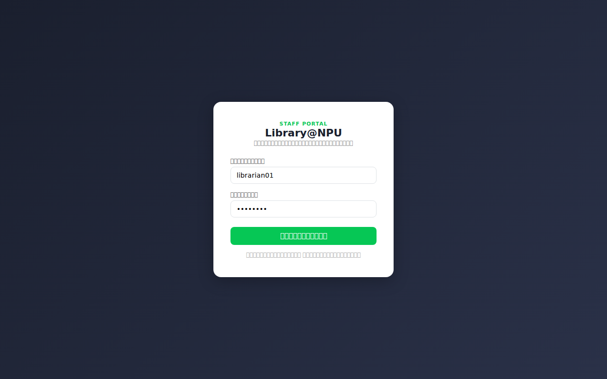

**ขั้นตอน:**

1. เปิดเบราว์เซอร์แล้วไปที่ `https://lib.npu.ac.th/reserv/manage/`
2. กรอก **ชื่อผู้ใช้** (username) ในช่องแรก
3. กรอก **รหัสผ่าน** (password) ในช่องที่สอง
4. คลิกปุ่ม **"เข้าสู่ระบบ"**

หากล็อกอินสำเร็จ ระบบจะพาไปยังหน้า Dashboard โดยอัตโนมัติ

> **ข้อควรระวัง:** หากกรอกชื่อผู้ใช้หรือรหัสผ่านผิด จะแสดงข้อความแจ้งเตือน "ชื่อผู้ใช้หรือรหัสผ่านไม่ถูกต้อง หรือไม่มีสิทธิ์เข้าใช้" บัญชีที่ไม่ใช่ Staff หรือ Admin จะเข้าระบบนี้ไม่ได้

### 2.2 หน้าตาหลัก — Sidebar และ Topbar

เมื่อเข้าสู่ระบบแล้วจะพบส่วนประกอบหลัก 2 ส่วน:

**Sidebar (แถบซ้าย)** — เมนูนำทางหลัก พื้นหลังสีเข้ม
- แสดงชื่อ "Staff Portal — Library@NPU"
- รายการเมนูทั้งหมดที่มีสิทธิ์เข้าถึง
- เมนูที่กำลังใช้งานจะไฮไลต์ด้วยสีเขียว

**Topbar (แถบบน)** — แสดงชื่อหน้าปัจจุบัน และบทบาทของผู้ใช้ที่ล็อกอินอยู่ (เจ้าหน้าที่ / ผู้ดูแลระบบ)

### 2.3 ออกจากระบบ

คลิก **"ออกจากระบบ"** ที่ด้านล่างของ Sidebar ระบบจะพาไปยังหน้าล็อกอินทันที

---

## บทที่ 3 Dashboard

**เข้าถึงได้โดย:** คลิก "Dashboard" ใน Sidebar

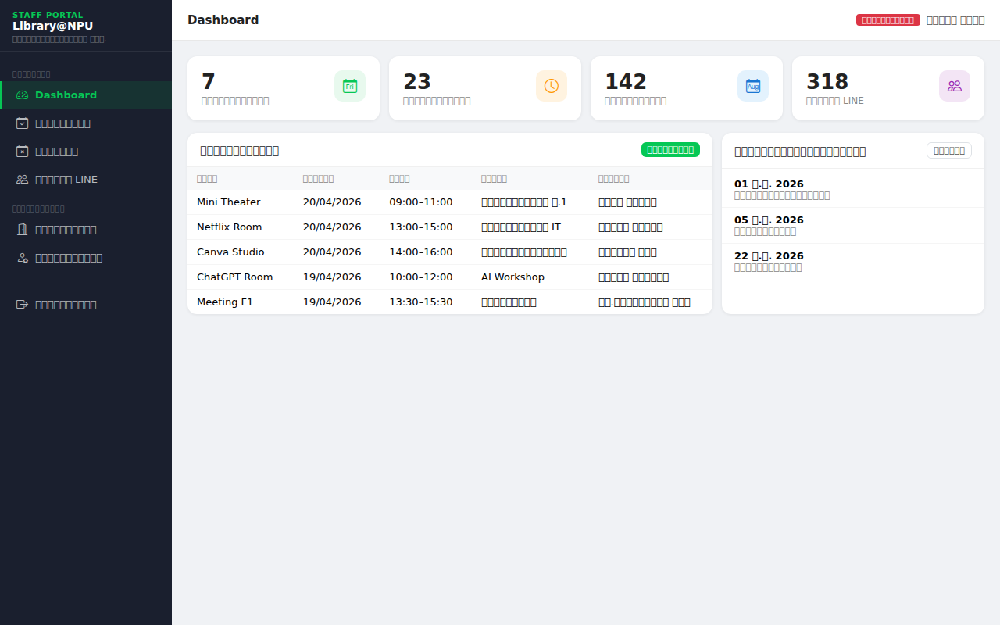

Dashboard คือหน้าแรกหลังเข้าสู่ระบบ แสดงภาพรวมสถานการณ์การจองในปัจจุบัน

### 3.1 การ์ดสถิติ

ด้านบนของหน้ามีการ์ดสถิติ 4 ใบ:

| การ์ด | ความหมาย |
|-------|----------|
| **การจองวันนี้** | จำนวนการจองที่ยืนยันแล้วในวันนี้ |
| **รอดำเนินการ** | จำนวนการจองที่ยืนยันแล้วตั้งแต่วันนี้เป็นต้นไป |
| **จองเดือนนี้** | จำนวนการจองทั้งหมดในเดือนปัจจุบัน |
| **ผู้ใช้ LINE** | จำนวนผู้ใช้ที่ลงทะเบียนและเปิดใช้งานอยู่ |

### 3.2 ตารางการจองล่าสุด

แสดงรายการจอง 10 รายการล่าสุดที่มีสถานะ "ยืนยันแล้ว" ประกอบด้วย ห้อง, วันที่, เวลา, ชื่อกลุ่ม และผู้จอง

คลิก **"ดูทั้งหมด"** เพื่อไปยังหน้ารายการจองครบถ้วน

### 3.3 วันหยุดที่กำลังจะมา

แสดงวันหยุดที่เปิดใช้งานอยู่ในช่วง 30 วันข้างหน้า พร้อมคำอธิบาย

คลิก **"จัดการ"** เพื่อไปยังหน้าจัดการวันหยุด

---

## บทที่ 4 จัดการรายการจอง

**เข้าถึงได้โดย:** คลิก "รายการจอง" ใน Sidebar
**สิทธิ์:** เจ้าหน้าที่และผู้ดูแลระบบ

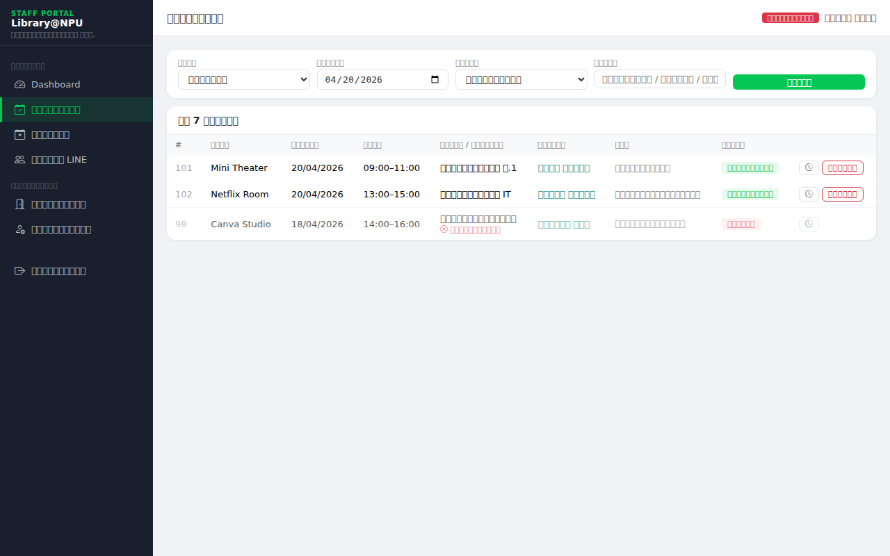

### 4.1 ดูและค้นหารายการจอง

ด้านบนของหน้ามีแถบกรองข้อมูล 4 ช่อง:

| ช่อง | ใช้สำหรับ |
|------|----------|
| **ห้อง** | กรองแสดงเฉพาะห้องที่เลือก |
| **วันที่** | กรองตามวันที่จอง |
| **สถานะ** | เลือกระหว่าง ทั้งหมด / ยืนยันแล้ว / ยกเลิกแล้ว |
| **ค้นหา** | พิมพ์ชื่อกลุ่ม, ชื่อผู้จอง หรือชื่อคณะ |

**ขั้นตอน:**
1. ตั้งค่า filter ที่ต้องการ
2. คลิกปุ่ม **"ค้นหา"**
3. ระบบแสดงผลและบอกจำนวนรายการที่พบ

คอลัมน์ในตาราง:
- **#** — หมายเลขการจอง
- **ห้อง** — ชื่อห้องที่จอง
- **วันที่** — วันที่จอง
- **เวลา** — เวลาเริ่ม–สิ้นสุด
- **กลุ่ม / กิจกรรม** — ชื่อกลุ่มที่ผู้จองระบุ (ถ้ายกเลิก จะแสดงเหตุผลสีแดงด้านล่าง)
- **ผู้จอง** — ชื่อผู้จอง (คลิกได้เพื่อดูประวัติ)
- **คณะ** — คณะหรือหน่วยงานของผู้จอง
- **สถานะ** — ยืนยันแล้ว (สีเขียว) / ยกเลิก (สีแดง)

> หากมีข้อมูลเกิน 20 รายการ ระบบจะแบ่งหน้า (Pagination) ให้กดลูกศรซ้าย–ขวาเพื่อเลื่อนหน้า

### 4.2 ยกเลิกการจอง

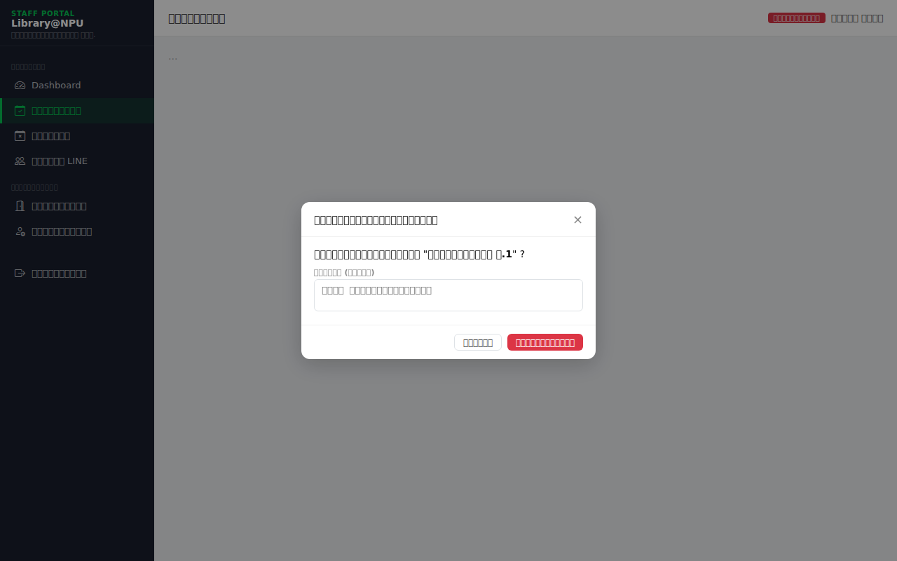

เจ้าหน้าที่สามารถยกเลิกการจองที่มีสถานะ "ยืนยันแล้ว" ได้

**ขั้นตอน:**
1. หาการจองที่ต้องการยกเลิกในตาราง
2. คลิกปุ่ม **"ยกเลิก"** (สีแดง) ที่ด้านขวาของแถว
3. กล่องยืนยัน (Modal) จะเปิดขึ้น แสดงชื่อกลุ่มที่จะยกเลิก
4. กรอก **เหตุผลการยกเลิก** (ไม่บังคับ แต่แนะนำให้ระบุ เช่น "ห้องปิดปรับปรุง")
5. คลิกปุ่ม **"ยืนยันยกเลิก"** (สีแดง)

> **ผลที่เกิดขึ้น:**
> - สถานะการจองเปลี่ยนเป็น "ยกเลิก"
> - ระบบส่ง **LINE Notification แจ้งผู้จอง** อัตโนมัติว่าการจองถูกยกเลิก พร้อมเหตุผล (ถ้ามี)
> - บันทึก Log การยกเลิก

### 4.3 ดู Logs การจอง

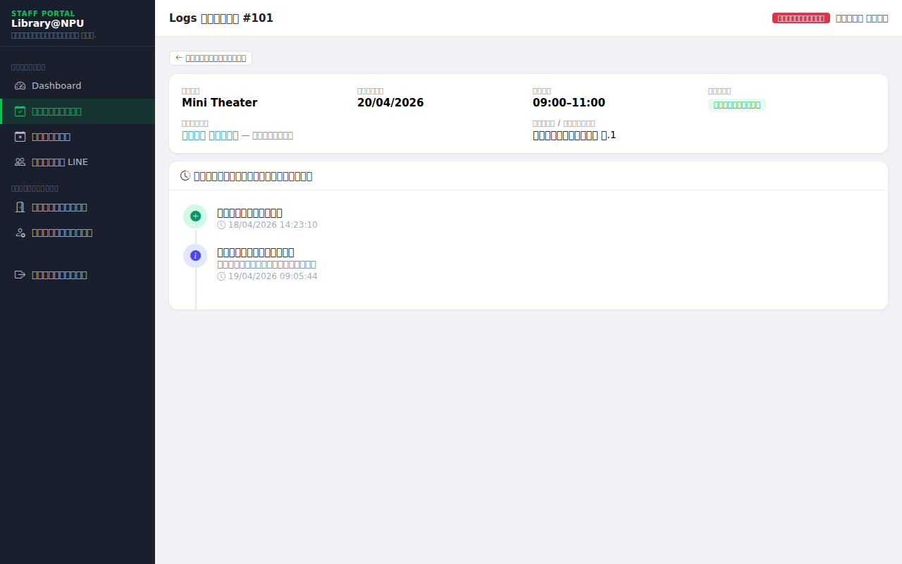

ทุกการจองมีบันทึก audit trail ให้ตรวจสอบย้อนหลัง

**ขั้นตอน:**
1. คลิกไอคอน **นาฬิกา** (🕐) ที่ด้านขวาของแถวการจอง
2. หน้า Logs จะแสดง:
   - ข้อมูลสรุปการจอง (ห้อง, วันที่, เวลา, ผู้จอง, กลุ่ม)
   - **Timeline ประวัติการดำเนินการ** เรียงตามเวลา

รายการ action ที่ปรากฏใน Timeline:

| Action | ไอคอน | สี | ความหมาย |
|--------|-------|-----|----------|
| สร้างการจอง | ➕ | เขียว | ผู้ใช้จองสำเร็จ |
| ยกเลิกการจอง | ✖ | แดง | ยกเลิกโดยผู้ใช้หรือเจ้าหน้าที่ |
| ปิดอุปกรณ์อัตโนมัติ | ⚡ | เหลือง | ระบบปิดอุปกรณ์ IoT หลังหมดเวลา |
| เข้าถึงข้อมูล | ℹ | น้ำเงิน | เจ้าหน้าที่ตรวจสอบรายการ |

### 4.4 ดูโปรไฟล์ผู้จอง

ในหน้ารายการจอง คลิกที่ **ชื่อผู้จอง** เพื่อดูข้อมูลส่วนตัวและประวัติการจองทั้งหมดของผู้นั้น (ดูรายละเอียดใน [บทที่ 6.2](#62-ดูโปรไฟล์และประวัติการจองรายบุคคล))

---

## บทที่ 5 จัดการวันหยุด

**เข้าถึงได้โดย:** คลิก "วันหยุด" ใน Sidebar
**สิทธิ์:** เจ้าหน้าที่และผู้ดูแลระบบ

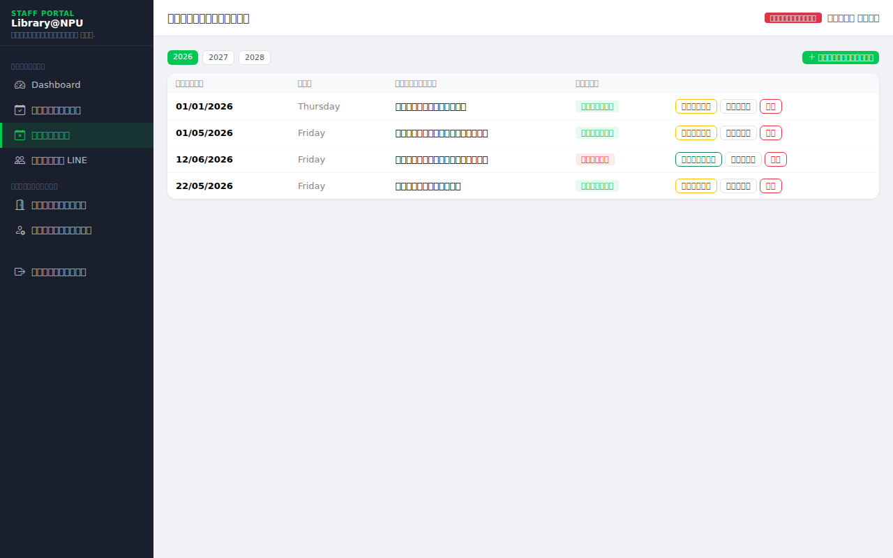

เมื่อกำหนดวันหยุด ระบบจะ **ปิดรับการจองอัตโนมัติ** ในวันดังกล่าว ผู้ใช้จะไม่สามารถเลือกวันนั้นในปฏิทินได้

### 5.1 ดูรายการวันหยุด

- ระบบแสดงวันหยุดแยกตามปี
- คลิกปุ่มปี (2026 / 2027 / 2028) เพื่อสลับดูข้อมูลของแต่ละปี
- แต่ละรายการแสดง: วันที่, วันในสัปดาห์, คำอธิบาย, สถานะ (เปิดใช้ / ปิดใช้)

### 5.2 เพิ่มวันหยุด

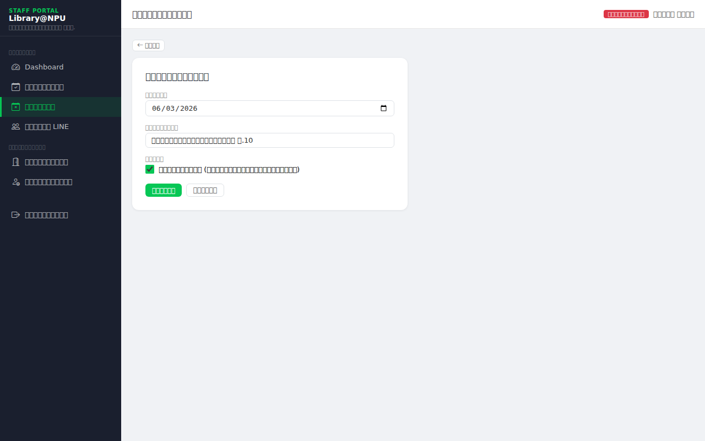

**ขั้นตอน:**
1. คลิกปุ่ม **"+ เพิ่มวันหยุด"** มุมบนขวา
2. กรอกข้อมูล:
   - **วันที่** — เลือกจาก Date Picker
   - **คำอธิบาย** — ชื่อวันหยุด เช่น "วันสงกรานต์"
   - **เปิดใช้งาน** — ติ๊กถ้าต้องการให้วันนี้ปิดรับจองทันที
3. คลิกปุ่ม **"บันทึก"**

### 5.3 แก้ไขวันหยุด

**ขั้นตอน:**
1. คลิกปุ่ม **"แก้ไข"** ที่แถววันหยุดที่ต้องการ
2. แก้ไขข้อมูลในฟอร์ม (เหมือนการเพิ่ม)
3. คลิกปุ่ม **"บันทึก"**

### 5.4 เปิด / ปิดใช้งานวันหยุด

ใช้สำหรับกรณีที่ต้องการ "พักใช้" วันหยุดชั่วคราวโดยไม่ลบออก

- คลิกปุ่ม **"ปิดใช้"** (สีเหลือง) — วันหยุดยังอยู่ในระบบแต่ระบบจะรับจองวันนั้นได้ตามปกติ
- คลิกปุ่ม **"เปิดใช้"** (สีเขียว) — วันหยุดกลับมาใช้งาน ระบบปิดรับจองวันนั้นทันที

### 5.5 ลบวันหยุด

**ขั้นตอน:**
1. คลิกปุ่ม **"ลบ"** (สีแดง) ที่แถววันหยุดที่ต้องการ
2. กล่องยืนยันจะเปิดขึ้น แสดงชื่อวันหยุดที่จะลบ
3. คลิก **"ลบ"** เพื่อยืนยัน

> **ข้อควรระวัง:** การลบวันหยุดจะนำวันนั้นออกจากระบบถาวร หากต้องการเก็บข้อมูลไว้ แนะนำให้ใช้การ "ปิดใช้" แทน

---

## บทที่ 6 จัดการผู้ใช้ LINE

**เข้าถึงได้โดย:** คลิก "ผู้ใช้ LINE" ใน Sidebar
**สิทธิ์:** เจ้าหน้าที่และผู้ดูแลระบบ

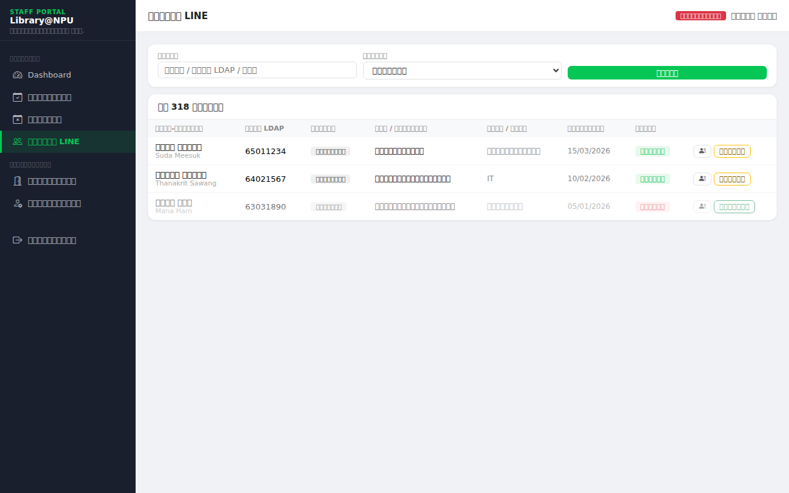

หน้านี้แสดงรายชื่อผู้ใช้ทุกคนที่ลงทะเบียนผูกบัญชี LINE กับระบบแล้ว

### 6.1 ดูรายชื่อผู้ใช้

ข้อมูลในตาราง:

| คอลัมน์ | ความหมาย |
|---------|----------|
| ชื่อ-นามสกุล | ชื่อจริงจาก NPU API (บรรทัดล่างคือชื่อ LINE) |
| รหัส LDAP | รหัสประจำตัวนักศึกษา / บุคลากร |
| ประเภท | นักศึกษา หรือ บุคลากรภายในมหาวิทยาลัย |
| คณะ / หน่วยงาน | สังกัด |
| สาขา / ฝ่าย | สาขาวิชา (นักศึกษา) หรือฝ่าย (บุคลากร) |
| วันที่ลงทะเบียน | วันแรกที่ผูกบัญชี |
| สถานะ | ใช้งาน (เขียว) / ปิดใช้ (แดง) |

**การค้นหา:**
1. กรอกคำค้นในช่อง "ค้นหา" (ค้นตามชื่อ, รหัส LDAP หรือคณะ)
2. เลือก "ประเภท" เพื่อกรองเฉพาะนักศึกษาหรือบุคลากร
3. คลิก **"ค้นหา"**

### 6.2 ดูโปรไฟล์และประวัติการจองรายบุคคล

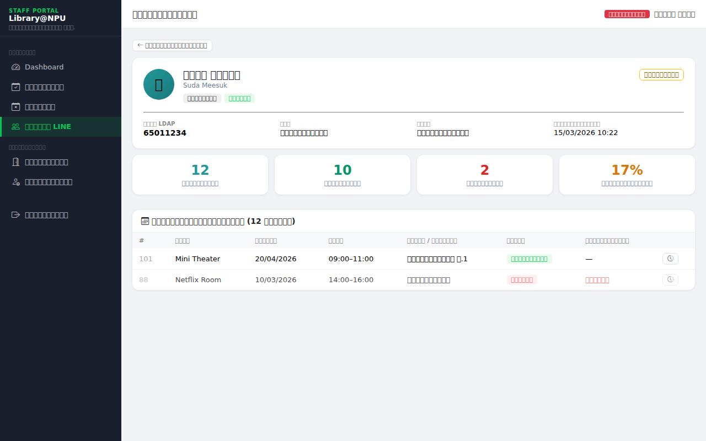

**ขั้นตอน:**
1. คลิกไอคอน **รายชื่อ** (👤) หรือคลิกชื่อผู้ใช้ในตาราง
2. หน้าโปรไฟล์จะแสดง:

**ส่วนข้อมูลส่วนตัว:**
- ชื่อ-นามสกุล, ชื่อ LINE, ประเภทผู้ใช้, สถานะ
- รหัส LDAP, คณะ/หน่วยงาน, สาขา/ฝ่าย, วันที่ลงทะเบียน

**ส่วนสถิติการจอง:**
- จองทั้งหมด, ยืนยันแล้ว, ยกเลิกแล้ว, อัตราการยกเลิก (%)

**ส่วนประวัติการจองทั้งหมด:**
- ตารางแสดงการจองทุกครั้ง ทั้งที่ยืนยันและยกเลิก
- คอลัมน์เหตุผลยกเลิก (แสดงถ้ามี)
- ปุ่ม Logs สำหรับดู audit trail ของแต่ละการจอง

### 6.3 เปิด / ปิดใช้งานผู้ใช้

เมื่อปิดใช้งานผู้ใช้ ผู้ใช้รายนั้นจะ **ไม่สามารถเข้าใช้ระบบจองได้** จนกว่าจะเปิดใช้งานอีกครั้ง

**จากหน้ารายชื่อ:**
- คลิกปุ่ม **"ปิดใช้"** (สีเหลือง) ที่แถวของผู้ใช้นั้น
- แถวนั้นจะเป็นสีจาง (ความโปร่งใส 55%) เพื่อบ่งบอกว่าปิดใช้อยู่

**จากหน้าโปรไฟล์:**
- คลิกปุ่ม **"ปิดใช้งาน"** หรือ **"เปิดใช้งาน"** มุมบนขวาของ Card

---

## บทที่ 7 จัดการห้อง (ผู้ดูแลระบบ)

**เข้าถึงได้โดย:** คลิก "จัดการห้อง" ใน Sidebar (หัวข้อ "ผู้ดูแลระบบ")
**สิทธิ์:** เฉพาะผู้ดูแลระบบ (Admin) เท่านั้น

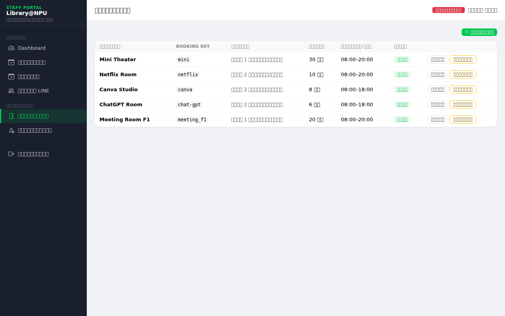

### 7.1 ดูรายการห้องทั้งหมด

ตารางแสดงข้อมูลห้องทั้งหมด:

| คอลัมน์ | ความหมาย |
|---------|----------|
| ชื่อห้อง | ชื่อเต็มที่แสดงในระบบ |
| Booking Key | รหัสย่อที่ใช้ใน URL เช่น `mini`, `netflix` |
| ที่ตั้ง | สถานที่ตั้งของห้อง |
| ความจุ | จำนวนคนสูงสุดที่รับได้ |
| เวลาเปิด–ปิด | ช่วงเวลาที่รับการจอง |
| สถานะ | เปิด (เขียว) / ปิด (แดง) |

### 7.2 เพิ่มห้องใหม่

**ขั้นตอน:**
1. คลิกปุ่ม **"+ เพิ่มห้อง"** มุมบนขวา
2. กรอกข้อมูลห้อง:
   - **ชื่อห้อง** — ชื่อที่แสดงแก่ผู้ใช้
   - **Booking Key** — รหัสภาษาอังกฤษตัวพิมพ์เล็ก ไม่มีช่องว่าง (ต้องไม่ซ้ำกับห้องอื่น)
   - **คำอธิบาย** — รายละเอียดห้อง (ไม่บังคับ)
   - **ที่ตั้ง** — ชั้น / อาคาร
   - **ความจุ** — จำนวนคน
   - **เวลาเปิด** / **เวลาปิด** — ช่วงเวลารับจอง
3. คลิก **"บันทึก"**

> **สำคัญ:** Booking Key ต้องเป็นภาษาอังกฤษ ตัวพิมพ์เล็ก ไม่มีช่องว่าง และไม่ซ้ำกับห้องอื่น เพราะจะถูกนำไปใช้เป็น URL เช่น `/booking/?room=mini`

### 7.3 แก้ไขข้อมูลห้อง

**ขั้นตอน:**
1. คลิกปุ่ม **"แก้ไข"** ที่แถวห้องที่ต้องการ
2. แก้ไขข้อมูลในฟอร์ม
3. คลิก **"บันทึก"**

### 7.4 เปิด / ปิดห้อง

ใช้สำหรับปิดรับจองชั่วคราว เช่น ห้องปรับปรุง

- คลิก **"ปิดห้อง"** (สีเหลือง) — ห้องจะไม่ปรากฏในหน้าจองของผู้ใช้
- คลิก **"เปิดห้อง"** (สีเขียว) — ห้องกลับมารับการจองได้ตามปกติ

---

## บทที่ 8 จัดการเจ้าหน้าที่ (ผู้ดูแลระบบ)

**เข้าถึงได้โดย:** คลิก "เจ้าหน้าที่" ใน Sidebar (หัวข้อ "ผู้ดูแลระบบ")
**สิทธิ์:** เฉพาะผู้ดูแลระบบ (Admin) เท่านั้น

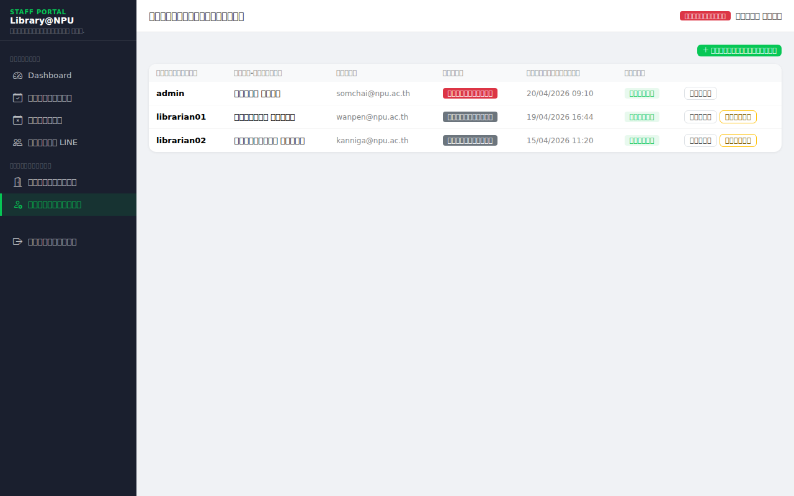

### 8.1 ดูรายชื่อเจ้าหน้าที่

ตารางแสดงบัญชีเจ้าหน้าที่และผู้ดูแลระบบทั้งหมด พร้อมข้อมูล:
- ชื่อผู้ใช้, ชื่อ-นามสกุล, อีเมล
- บทบาท (ผู้ดูแลระบบ = แดง / เจ้าหน้าที่ = เทา)
- เวลาเข้าใช้ล่าสุด
- สถานะ (ใช้งาน / ปิดใช้)

### 8.2 เพิ่มบัญชีเจ้าหน้าที่

**ขั้นตอน:**
1. คลิกปุ่ม **"+ เพิ่มเจ้าหน้าที่"**
2. กรอกข้อมูล:
   - **ชื่อผู้ใช้** (username) — ไม่มีช่องว่าง ไม่ซ้ำ
   - **ชื่อ** / **นามสกุล** — ไม่บังคับ
   - **อีเมล** — ไม่บังคับ
   - **รหัสผ่าน** / **ยืนยันรหัสผ่าน** — ต้องตรงกัน
   - **บทบาทผู้ดูแลระบบ** — ติ๊กถ้าต้องการให้มีสิทธิ์ Admin เต็ม
3. คลิก **"บันทึก"**

> บัญชีใหม่จะเป็น Staff (เจ้าหน้าที่) โดยอัตโนมัติ เว้นแต่ติ๊ก "บทบาทผู้ดูแลระบบ"

### 8.3 แก้ไขข้อมูล / เปลี่ยนรหัสผ่าน / ปรับสิทธิ์

**ขั้นตอน:**
1. คลิกปุ่ม **"แก้ไข"** ที่แถวเจ้าหน้าที่ที่ต้องการ
2. แก้ไขข้อมูล:
   - เปลี่ยนชื่อ, นามสกุล, อีเมล
   - เปลี่ยนสิทธิ์ (Admin ↔ Staff) ผ่านช่อง "บทบาทผู้ดูแลระบบ"
   - **เปลี่ยนรหัสผ่าน** — กรอกรหัสใหม่ในช่อง "รหัสผ่านใหม่" (ถ้าต้องการ ถ้าไม่กรอกจะไม่เปลี่ยน)
3. คลิก **"บันทึก"**

### 8.4 เปิด / ปิดใช้งานบัญชี

- คลิก **"ปิดใช้"** — บัญชีนั้นจะเข้าสู่ระบบไม่ได้ชั่วคราว
- คลิก **"เปิดใช้"** — บัญชีกลับมาใช้งานได้

> **ข้อควรระวัง:** ผู้ดูแลระบบไม่สามารถปิดหรือลบบัญชีของตัวเองได้ ปุ่ม "ปิดใช้" จะไม่ปรากฏในแถวของบัญชีที่กำลังล็อกอินอยู่

---

## บทที่ 9 คำถามที่พบบ่อย

### ลืมรหัสผ่าน ต้องทำอย่างไร?

ระบบไม่มีการรีเซ็ตรหัสผ่านอัตโนมัติ ต้องติดต่อผู้ดูแลระบบ (Admin) เพื่อเปลี่ยนรหัสผ่านในหน้า **"จัดการเจ้าหน้าที่ → แก้ไข"**

### ผู้ใช้ LINE ถูกปิดใช้งาน จะเปิดอีกครั้งได้อย่างไร?

1. ไปที่ **ผู้ใช้ LINE**
2. ค้นหาชื่อหรือรหัส LDAP
3. คลิกปุ่ม **"เปิดใช้"** ที่แถวของผู้ใช้นั้น

### ต้องการปิดห้องชั่วคราว ต้องทำอย่างไร?

**กรณีปิดห้องทั้งวัน (เช่น ซ่อมแซม):**
- ไปที่ **จัดการห้อง** (ต้องเป็น Admin) → คลิก **"ปิดห้อง"**
- เมื่อห้องพร้อมใช้แล้ว → คลิก **"เปิดห้อง"**

**กรณีปิดเฉพาะวัน (เช่น งานพิเศษ):**
- ไปที่ **วันหยุด** → เพิ่มวันที่นั้นเป็นวันหยุด

### เพิ่มวันหยุดแล้วแต่ผู้ใช้ยังเลือกวันนั้นได้อยู่

ตรวจสอบว่า **สถานะของวันหยุดนั้นเป็น "เปิดใช้"** หรือไม่
ถ้าเป็น "ปิดใช้" ระบบจะยังรับการจองวันนั้น → คลิก **"เปิดใช้"** เพื่อเปิดใช้งานวันหยุดนั้น

### มีการจองซ้อนกัน (Conflict) จะรู้ได้อย่างไร?

ระบบตรวจสอบและป้องกันการจองซ้อนกันอัตโนมัติ ผู้ใช้จะไม่สามารถจองช่วงเวลาที่ถูกจองแล้วได้ เจ้าหน้าที่ไม่ต้องตรวจสอบด้วยตนเอง

### ต้องการดูว่าห้องไหนจองเยอะที่สุดในเดือนนี้

ใช้หน้า **รายการจอง** กรองด้วย:
- ตั้งค่า "สถานะ" = ยืนยันแล้ว
- เลือก "ห้อง" ทีละห้องแล้วดูจำนวนรายการที่พบ

---

## ภาคผนวก

### ภาคผนวก ก — ข้อมูลห้องบริการทั้ง 5 ห้อง

| ชื่อห้อง | Booking Key | ที่ตั้ง | ความจุ | เวลาเปิด–ปิด |
|---------|------------|--------|--------|--------------|
| Mini Theater | `mini` | ชั้น 1 อาคารบรรณสาร | 30 คน | 08:00–20:00 |
| Netflix Room | `netflix` | ชั้น 2 อาคารบรรณสาร | 10 คน | 08:00–20:00 |
| Canva Studio | `canva` | ชั้น 2 อาคารบรรณสาร | 8 คน | 08:00–18:00 |
| ChatGPT Room | `chat-gpt` | ชั้น 2 อาคารบรรณสาร | 6 คน | 08:00–18:00 |
| Meeting Room F1 | `meeting_f1` | ชั้น 1 อาคารบรรณสาร | 20 คน | 08:00–20:00 |

### ภาคผนวก ข — การแจ้งเตือน LINE ที่ระบบส่งอัตโนมัติ

ระบบส่ง LINE Notification ถึงผู้จองในกรณีต่อไปนี้:

| เหตุการณ์ | ผู้รับแจ้งเตือน | เนื้อหา |
|----------|---------------|--------|
| จองสำเร็จ | ผู้จอง | ชื่อห้อง, วันที่, เวลา, ชื่อกลุ่ม |
| ยกเลิกโดยผู้ใช้ | ผู้จอง | แจ้งการยกเลิกพร้อมเหตุผล |
| ยกเลิกโดยเจ้าหน้าที่ | ผู้จอง | แจ้งการยกเลิกพร้อมเหตุผล (ถ้ากรอก) |

> เจ้าหน้าที่ **ไม่ต้องแจ้งผู้จองด้วยตนเอง** ระบบจัดการส่งแจ้งเตือนให้อัตโนมัติทุกครั้ง

---

*คู่มือนี้จัดทำโดยสำนักวิทยบริการ มหาวิทยาลัยนครพนม | Smart Creative Learning Space*
